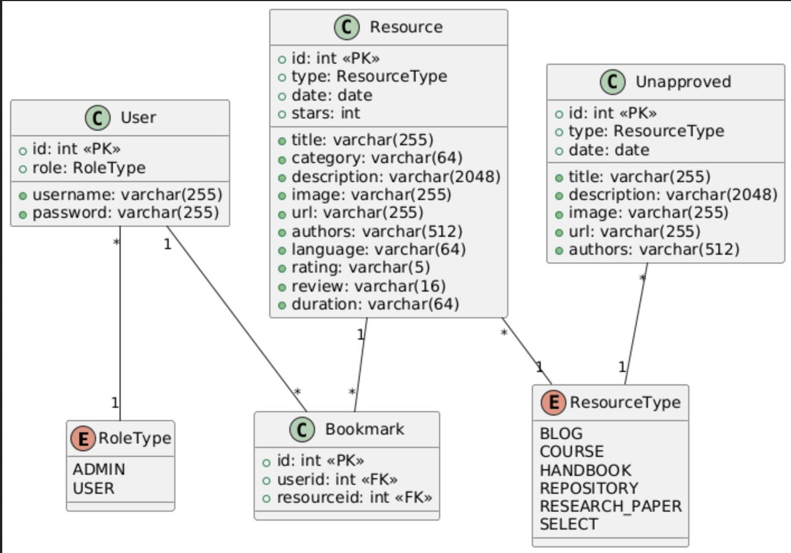

# AI Learning Hub - Installation Guide and User Documentaion
A Python-based single page web application that serves as a centralized search hub for students, researchers, and AI enthusiasts to explore AI-related tutorials, handbooks, research materials, coding resources, and GitHub repositories. We use Python-based UI framework NiceGUI, a SQLite DB and Tortoise ORM for iteracting with the DB.

- [Installation Guide](#installation-guide)
- [User Documentation](#user-documentation)
- [DataBase Schema](#database-schema)
  
## Installation Guide

Follow these instructions to set up the environment before running the main file.

1. **Create a virtual environment:**
   ```sh
   python -m venv venv
   ```
2. **Activate the virtual environment:**
   - On Windows:
     ```sh
     venv\Scripts\activate
     ```
   - On macOS/Linux:
     ```sh
     source venv/bin/activate
     ```
3. **Install dependencies:**
   ```sh
   pip install -r requirements.txt
   ```
### Running the Application

After setting up the environment, run the `main.py` file using:

```sh
python main.py
```

### Notes
- Ensure you have Python installed before proceeding.
- If you encounter permission issues, try running the commands with administrative privileges.

## User Documentation

### Getting Started
Visit: http://ec2-54-193-115-8.us-west-1.compute.amazonaws.com:8080/
- Username: niyati/mrudula
- Password: password

### 1. Resource Search & Discovery
#### Main Search Features:
- **Search Bar**: Located at the top of the page
  - Type keywords related to AI, Machine Learning, Deep Learning
  - Results update in real-time
  - Searches across titles, descriptions, and content
  - Access the filter panel to refine your search:

- **Resource Types**
   - Courses (Coursera, Udacity, Fast.ai, MIT AI)
   - Handbooks (Deep Learning Book, Stanford CS229)
   - Research Papers (arXiv, Papers With Code)
   - Repositories (GitHub projects)
   - Blogs (Towards Data Science, OpenAI Blog)

- Resources are sorted on the basis of Date, Stars, and Ratings

### 2. Exploring Learning Materials
Browse resources by major categories:

- **Online Courses**
   - Premium courses from Coursera, Udacity
   - Free courses from Fast.ai, MIT
   - Filter by duration and difficulty level

- **AI Handbooks & Documentation**
   - Comprehensive guides like Deep Learning Book
   - Technical documentation

- **Research Papers**
   - Latest publications from arXiv
   - Featured papers from Papers With Code
   - Academic research materials

- **AI Blogs & Communities**
   - Articles from Towards Data Science
   - OpenAI Blog posts

### 3. GitHub Repository Section

#### Exploring AI Projects
View trending AI repositories
- Key metrics are as follows:
  - Star count
  - Project description
  - Programming languages
  - Recent updates

### 4. Managing Bookmarks

#### Saving Resources
- Find a resource you want to save
- Click the bookmark icon on the resource card
- Access saved items through "Bookmarks" tab on the Dashboard

#### Bookmark Management
- Filter saved resources by type
- Remove bookmarks by clicking the unbookmark icon

### 5. AI Assistant Chat
#### Using the Chatbot
- Click the chat icon in the bottom right
- Ask questions about:
  - Resource recommendations
  - Learning paths
  - Technical concepts
  - Finding specific materials

#### Example Queries:
- "Find beginner machine learning courses"
- "Show me deep learning research papers"
- "Recommend Python AI tutorials"

### 6. Contributing Resources
#### Submitting New Content
Currently, resource submissions are managed by administrators. Contact the admin team to suggest new resources. The following resources can be submitted:
- Online courses
- Tutorial links
- Research papers
- GitHub repositories
- Blog posts
- Learning materials

## DataBase Schema
The website is backed by SQLite DB which has the following tables and schema:


